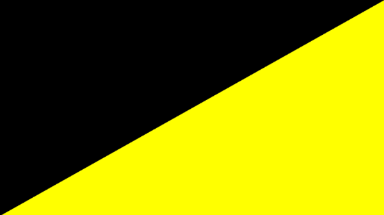
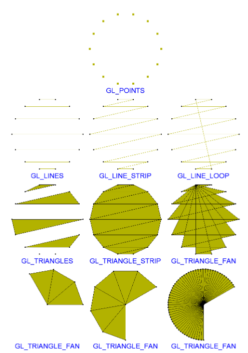

# BAB 1. Introduction to WebGL

WebGL (**Web Graphics Library**) adalah API berbasis **JavaScript** yang
digunakan untuk menampilkan grafis **2D** dan **3D** di dalam browser
tanpa memerlukan plugin tambahan. WebGL dibangun di atas standar
**OpenGL ES** (khususnya versi 2.0), sehingga memanfaatkan kemampuan
**GPU (Graphics Processing Unit)** untuk mempercepat rendering grafis.

Dengan WebGL, kita bisa membuat:

-   Visualisasi data 3D interaktif
-   Game berbasis web
-   Efek grafis kompleks seperti simulasi fisika, partikel, atau
    pencahayaan real-time
-   Peta 3D dan model interaktif

Bab ini akan berfokus pada setup WebGL untuk digunakan pada bab-bab
berikutnya.

------------------------------------------------------------------------

## 1.1 Setup Project

Buat file `index.html` dan `main.js` sebagai berikut:

### **index.html**

``` html
<!DOCTYPE html>
<html>
<head>
    <meta charset="UTF-8">
    <script src="main.js"></script>
</head>
<body style="margin: 0">
</body>
</html>
```

### **main.js**

``` javascript
function main() {

}
window.addEventListener('load', main);
```

------------------------------------------------------------------------

## 1.2 Menambahkan Canvas

Untuk menghasilkan gambar menggunakan WebGL, kita memerlukan **canvas**
di HTML.

### **index.html**

``` html
<canvas id="mycanvas" style="display: block; width: 100%; height: 100%; background-color: black;"></canvas>
```

### **main.js**

``` javascript
function main() {
    var CANVAS = document.getElementById("mycanvas");
    CANVAS.width = window.innerWidth;
    CANVAS.height = window.innerHeight;
}
window.addEventListener('load', main);
```

------------------------------------------------------------------------

## 1.3 Inisialisasi WebGL

Tambahkan inisialisasi context WebGL:

``` javascript
var GL;
try {
    GL = CANVAS.getContext("webgl", { antialias: true });
} catch (e) {
    alert("WebGL context cannot be initialized");
    return false;
}
```

------------------------------------------------------------------------

## 1.4 Shader WebGL

Shader adalah potongan kode GLSL yang dijalankan di GPU.

### **Vertex Shader**

``` glsl
attribute vec2 position;
void main(void) {
    gl_Position = vec4(position, 0., 1.);
}
```

### **Fragment Shader**

``` glsl
precision mediump float;
uniform vec3 uColor;
void main(void) {
    gl_FragColor = vec4(uColor, 1.);
}
```

Lalu buat fungsi **compile_shader**:

``` javascript
var compile_shader = function (source, type, typeString) {
    var shader = GL.createShader(type);
    GL.shaderSource(shader, source);
    GL.compileShader(shader);
    if (!GL.getShaderParameter(shader, GL.COMPILE_STATUS)) {
        alert("ERROR IN " + typeString + " SHADER: " + GL.getShaderInfoLog(shader));
        return false;
    }
    return shader;
};
```

------------------------------------------------------------------------

## 1.5 Shader Program

``` javascript
var shader_vertex = compile_shader(shader_vertex_source, GL.VERTEX_SHADER, "VERTEX");
var shader_fragment = compile_shader(shader_fragment_source, GL.FRAGMENT_SHADER, "FRAGMENT");

var SHADER_PROGRAM = GL.createProgram();
GL.attachShader(SHADER_PROGRAM, shader_vertex);
GL.attachShader(SHADER_PROGRAM, shader_fragment);
GL.linkProgram(SHADER_PROGRAM);

var _position = GL.getAttribLocation(SHADER_PROGRAM, "position");
GL.enableVertexAttribArray(_position);
GL.useProgram(SHADER_PROGRAM);

var uniform_color = GL.getUniformLocation(SHADER_PROGRAM, "uColor");
```

------------------------------------------------------------------------

## 1.6 Membuat Triangle

``` javascript
var triangle_vertex = [
    -1, -1,
     1, -1,
     1,  1
];

var TRIANGLE_VERTEX = GL.createBuffer();
GL.bindBuffer(GL.ARRAY_BUFFER, TRIANGLE_VERTEX);
GL.bufferData(GL.ARRAY_BUFFER, new Float32Array(triangle_vertex), GL.STATIC_DRAW);
```

------------------------------------------------------------------------

## 1.7 Rendering

``` javascript
GL.clearColor(0.0, 0.0, 0.0, 1.0);
var animate = function () {
    GL.viewport(0, 0, CANVAS.width, CANVAS.height);
    GL.clear(GL.COLOR_BUFFER_BIT);

    GL.bindBuffer(GL.ARRAY_BUFFER, TRIANGLE_VERTEX);
    GL.vertexAttribPointer(_position, 2, GL.FLOAT, false, 4 * 2, 0);
    GL.uniform3f(uniform_color, 1, 1, 0);
    GL.drawArrays(GL.TRIANGLES, 0, triangle_vertex.length / 2);

    GL.flush();
    window.requestAnimationFrame(animate);
};
animate();
```


------------------------------------------------------------------------

## 1.8 Draw Mode



Untuk menggambar **points**, tambahkan `gl_PointSize` di vertex shader:

``` glsl
gl_PointSize = 10.0;
```

------------------------------------------------------------------------

## 1.9 Faces dan EBO

Tambahkan **faces** dan gunakan **Element Buffer Object**:

``` javascript
var triangle_faces = [0, 1, 2];
var TRIANGLE_FACES = GL.createBuffer();
GL.bindBuffer(GL.ELEMENT_ARRAY_BUFFER, TRIANGLE_FACES);
GL.bufferData(GL.ELEMENT_ARRAY_BUFFER, new Uint16Array(triangle_faces), GL.STATIC_DRAW);
```

Menggambar menggunakan `drawElements`:

``` javascript
GL.bindBuffer(GL.ELEMENT_ARRAY_BUFFER, TRIANGLE_FACES);
GL.drawElements(GL.TRIANGLES, triangle_faces.length, GL.UNSIGNED_SHORT, 0);
```

Untuk membuat **persegi**, tambahkan vertex dan faces:

``` javascript
var triangle_vertex = [
    -1, -1,
     1, -1,
     1,  1,
    -1,  1
];

var triangle_faces = [
    0, 1, 2,
    0, 2, 3
];
```

------------------------------------------------------------------------

## 1.10 Vertex Color

Untuk memberi warna pada tiap vertex:

### **Vertex Shader**

``` glsl
attribute vec2 position;
attribute vec3 color;
varying vec3 vColor;
void main(void) {
    gl_Position = vec4(position, 0., 1.);
    vColor = color;
}
```

### **Fragment Shader**

``` glsl
precision mediump float;
varying vec3 vColor;
void main(void) {
    gl_FragColor = vec4(vColor, 1.);
}
```

Atur vertex data dan warna:

``` javascript
var triangle_vertex = [
    -1, -1, 1, 0, 0,
     1, -1, 1, 1, 0,
     1,  1, 0, 1, 0,
    -1,  1, 0, 0, 1
];
```

