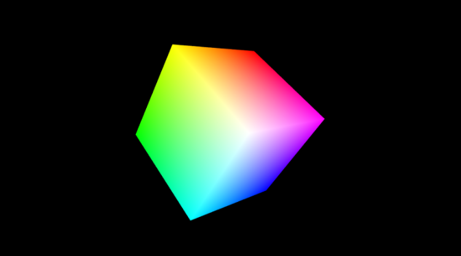

# BAB 2. 3D Object

Objek 3D adalah representasi suatu bentuk di ruang tiga dimensi yang
memiliki panjang (**X**), lebar (**Y**), dan kedalaman (**Z**). Dalam
komputer grafis, objek 3D biasanya dibangun dari sekumpulan **vertex**
yang dihubungkan menjadi **edge** dan **face**, sehingga membentuk
**mesh** atau permukaan objek. Dalam WebGL atau grafik komputer, semua
objek 3D pada akhirnya diproyeksikan ke tampilan **2D** di layar melalui
proses **rendering**.

------------------------------------------------------------------------

## 2.1. Transformation

Dalam grafika komputer, **transformasi** adalah proses mengubah posisi,
orientasi, atau ukuran suatu objek pada ruang 2D maupun 3D. Transformasi
umumnya dilakukan melalui tiga operasi utama:

-   **Translasi** → Memindahkan objek dari satu posisi ke posisi lain.
-   **Rotasi** → Memutar objek terhadap titik atau sumbu tertentu.
-   **Skala** → Mengubah ukuran objek secara proporsional atau tidak.

Semua operasi ini direpresentasikan menggunakan **matriks
transformasi**, yang memungkinkan kombinasi transformasi secara efisien.

------------------------------------------------------------------------

## 2.2. Membuat libs.js

Buat file `libs.js` untuk menyimpan fungsi-fungsi transformasi:

``` javascript
var LIBS = {
    degToRad: function (angle) {
        return (angle * Math.PI / 180);
    },

    get_projection: function (angle, a, zMin, zMax) {
        var tan = Math.tan(LIBS.degToRad(0.5 * angle)),
            A = -(zMax + zMin) / (zMax - zMin),
            B = (-2 * zMax * zMin) / (zMax - zMin);

        return [
            0.5 / tan, 0, 0, 0,
            0, 0.5 * a / tan, 0, 0,
            0, 0, A, -1,
            0, 0, B, 0
        ];
    },

    get_I4: function () {
        return [1, 0, 0, 0,
                0, 1, 0, 0,
                0, 0, 1, 0,
                0, 0, 0, 1];
    },

    set_I4: function (m) {
        m[0] = 1, m[1] = 0, m[2] = 0, m[3] = 0,
        m[4] = 0, m[5] = 1, m[6] = 0, m[7] = 0,
        m[8] = 0, m[9] = 0, m[10] = 1, m[11] = 0,
        m[12] = 0, m[13] = 0, m[14] = 0, m[15] = 1;
    },

    rotateX: function (m, angle) {
        var c = Math.cos(angle);
        var s = Math.sin(angle);
        var mv1 = m[1], mv5 = m[5], mv9 = m[9];
        m[1] = m[1] * c - m[2] * s;
        m[5] = m[5] * c - m[6] * s;
        m[9] = m[9] * c - m[10] * s;

        m[2] = m[2] * c + mv1 * s;
        m[6] = m[6] * c + mv5 * s;
        m[10] = m[10] * c + mv9 * s;
    },

    rotateY: function (m, angle) {
        var c = Math.cos(angle);
        var s = Math.sin(angle);
        var mv0 = m[0], mv4 = m[4], mv8 = m[8];
        m[0] = c * m[0] + s * m[2];
        m[4] = c * m[4] + s * m[6];
        m[8] = c * m[8] + s * m[10];

        m[2] = c * m[2] - s * mv0;
        m[6] = c * m[6] - s * mv4;
        m[10] = c * m[10] - s * mv8;
    },

    rotateZ: function (m, angle) {
        var c = Math.cos(angle);
        var s = Math.sin(angle);
        var mv0 = m[0], mv4 = m[4], mv8 = m[8];
        m[0] = c * m[0] - s * m[1];
        m[4] = c * m[4] - s * m[5];
        m[8] = c * m[8] - s * m[9];

        m[1] = c * m[1] + s * mv0;
        m[5] = c * m[5] + s * mv4;
        m[9] = c * m[9] + s * mv8;
    },

    translateZ: function (m, t) { m[14] += t; },
    translateX: function (m, t) { m[12] += t; },
    translateY: function (m, t) { m[13] += t; },

    set_position: function (m, x, y, z) {
        m[12] = x; m[13] = y; m[14] = z;
    }
};
```

Tambahkan `libs.js` pada **index.html**:

``` html
<!DOCTYPE html>
<html>
<head>
    <meta charset="UTF-8">
    <script src="libs.js"></script>
    <script src="main.js"></script>
</head>
<body style="margin: 0">
    <canvas id="mycanvas" style="display: block; width: 100%; height: 100%; background-color: black;"></canvas>
</body>
</html>
```

------------------------------------------------------------------------

## 2.3. Membuat Cube

Pada `main.js`, definisikan vertex dan face untuk kubus, lalu lakukan
inisialisasi:

``` javascript
var cube_vertex = [
    -1, -1, -1, 0, 0, 0,
     1, -1, -1, 1, 0, 0,
     1,  1, -1, 1, 1, 0,
    -1,  1, -1, 0, 1, 0,
    -1, -1,  1, 0, 0, 1,
     1, -1,  1, 1, 0, 1,
     1,  1,  1, 1, 1, 1,
    -1,  1,  1, 0, 1, 1
];

var cube_faces = [
    0, 1, 2, 0, 2, 3,
    4, 5, 6, 4, 6, 7,
    0, 3, 7, 0, 4, 7,
    1, 2, 6, 1, 5, 6,
    2, 3, 6, 3, 7, 6,
    0, 1, 5, 0, 4, 5
];
```

Lakukan inisialisasi buffer:

``` javascript
var CUBE_VERTEX = GL.createBuffer();
GL.bindBuffer(GL.ARRAY_BUFFER, CUBE_VERTEX);
GL.bufferData(GL.ARRAY_BUFFER, new Float32Array(cube_vertex), GL.STATIC_DRAW);

var CUBE_FACES = GL.createBuffer();
GL.bindBuffer(GL.ELEMENT_ARRAY_BUFFER, CUBE_FACES);
GL.bufferData(GL.ELEMENT_ARRAY_BUFFER, new Uint16Array(cube_faces), GL.STATIC_DRAW);
```

------------------------------------------------------------------------

## 2.4. Modifikasi Shader

Untuk menggambar 3D object, shader perlu menggunakan **projection
matrix**, **view matrix**, dan **model matrix**:

### Vertex Shader

``` glsl
attribute vec3 position;
uniform mat4 Pmatrix, Vmatrix, Mmatrix;
attribute vec3 color;
varying vec3 vColor;

void main(void) {
    gl_Position = Pmatrix * Vmatrix * Mmatrix * vec4(position, 1.);
    vColor = color;
}
```

### Fragment Shader

``` glsl
precision mediump float;
varying vec3 vColor;

void main(void) {
    gl_FragColor = vec4(vColor, 1.);
}
```

------------------------------------------------------------------------

## 2.5. Animasi Cube

Tambahkan animasi rotasi pada fungsi `animate`:

``` javascript
LIBS.rotateZ(MOVEMATRIX, dt*0.001);
LIBS.rotateY(MOVEMATRIX, dt*0.001);
LIBS.rotateX(MOVEMATRIX, dt*0.001);
```


